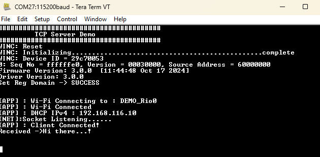

# TCP Server

This WINCS02 application implements a TCP Server. In this application WINCS02 will host a TCP Server in Wi-Fi STA mode. The user is required to configure the Wi-Fi credentials for Home-AP and specify the port number at which the TCP server would be listening. By default application will connect to Home-AP and starts a TCP Server on the board. After establishing a successful TCP server-client connection, the data exchange will take place.

## Building the Application

To build this application, open the project file \(`apps/tcp_server/firmware/tcp_server_sam_e54_xpro_wincs02.X/`\) in MPLAB X IDE. For more details on opening the project file in MPLAB X IDE, refer to the [Opening the Project File](https://onlinedocs.microchip.com/oxy/GUID-92FEB3A1-C10F-47DF-BF88-C06521800526-en-US-1/GUID-671CCA8C-64AE-4EA1-B144-D46A6FEE76FF.html#GUID-671CCA8C-64AE-4EA1-B144-D46A6FEE76FF__SECTION_YRV_2WM_QYB). The following table provides details on the project file.

|Project Name|Description|
|------------|-----------|
|`tcp_server_sam_e54_xpro_wincs02.X`| -   MPLABX project for SAM E54 Xplained Pro evaluation kit and WINCS02 Add On Board
-   This application demonstrates a TCP server in Host Companion mode. After establishing a successful TCP server-client connection, the data exchange will take place

## Running the Application

1.  Mount the WINCS02 Add On Board on SAM E54 Xplained Pro evaluation kit at respective header. For more details about the boards placement in the SAM E54 X-plained host board, see [Figure 6-70](https://onlinedocs.microchip.com/oxy/GUID-92FEB3A1-C10F-47DF-BF88-C06521800526-en-US-1/GUID-7BA99DE1-89EB-4DD7-973B-974B175D657A.html#GUID-7BA99DE1-89EB-4DD7-973B-974B175D657A__FIG_PKK_14T_11C)
2.  Connect the debugger USB port on the SAM E54 Xplained Pro evaluation kit to computer using a micro-USB cable.
3.  Open the project and launch MCC Harmony3.
4.  Configure Home-AP credentials for STA mode, using the WINCS02 Wi-Fi configuration options. For more details about the Wi-Fi settings configuration, See [Figure 3-64](https://onlinedocs.microchip.com/oxy/GUID-92FEB3A1-C10F-47DF-BF88-C06521800526-en-US-1/GUID-CE9CEDFD-5FD4-4BC4-AB96-17647C430816.html#GUID-CE9CEDFD-5FD4-4BC4-AB96-17647C430816__GUID-98F61951-56D2-4B91-B509-2A796802408B).
5.  Generate the code as illustrated below.

     

    

     

6. Update the SYS_WINCS_NET_NO_OF_CLIENT_SOCKETS macro present in sys_WINCS_net_service.h to reflect the number of client sockets the system can manage in server mode. (supports max 5 clients)

7.  Build and program the code to the hardware using MPLABX IDE.

     

    

     

8.  Open the Terminal application \(for example, Tera Term or PuTTY\) on the PC

    Connect to the "EDBG Virtual COM Port" and configure the serial settings as follows:

    1.  Baud: 115200
    2.  Data: 8 Bits
    3.  Parity: None
    4.  Stop: 1 Bit
    5.  Flow Control: None
9.  As the board boots up, it will connect to Home-AP and print the IP address obtained. After establishing a successful TCP server-client connection, the application will continue listening on the socket number configured for incoming messages and then write them back to the client connected.

    
