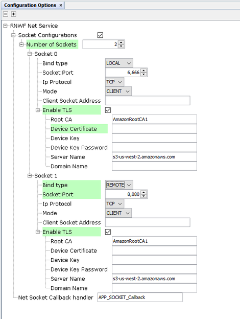
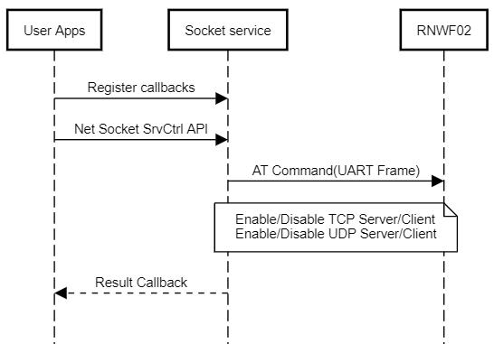

# Net Socket Service

The Net Socket service provides network and socket services to the user application. It includes DHCP server configuration for the Wi-Fi interface and API's for socket operations such as open, read, write and close. It also provides 2 simultaneous TLS configuration instances which can be used with a given socket communication tunnel. The Net service API call syntax is provided below:

``` {#CODEBLOCK_JKQ_PVT_TYB .language-c}
SYS_RNWF_RESULT_t SYS_RNWF_NET_SOCK_SrvCtrl( SYS_RNWF_NET_SOCK_SERVICE_t request, void *input)
```

**Net System Service Configuration in MCC**


<br />

This section allows NET service basic configuration as mentioned below:
-   **Bind type:** Selection of binding type.
-   **Socket Port:** Socket port number.
-   **Ip Protocol:** TCP/UDP protocol selection.
-   **Socket address:** Enter the respective server IP address.
-   **Mode:** Server/Client Mode Selection

The Net service provides the following services for the user:

|Services/Options|Input Parameters|Description|
|----------------|----------------|-----------|
|`SYS_RNWF_NET_TLS_CONFIG_1`|TLS configuration list: CA name,<br /> Certificate name, Key name, Key password, server<br /> name|Use the TLS configuration 1|
|`SYS_RNWF_NET_TLS_CONFIG_2`|TLS configuration list: CA name,<br /> Certificate name, Key name, Key password, server<br /> name|Use the TLS configuration 2|
|`SYS_RNWF_NET_DHCP_SERVER_ENABLE`|DHCP Configuration: Set IP, Pool start,<br /> Parameter ID \(Int\)<br />Parameter value \(String\)|Enable the DHCP server|
|`SYS_RNWF_NET_DHCP_SERVER_DISABLE`|None|Disable the DHCP server|
|`SYS_RNWF_NET_SOCK_TCP_OPEN`|None|Open TCP socket. Returns socket ID.|
|`SYS_RNWF_NET_SOCK_UDP_OPEN`|None|Open UDP socket. Returns socket ID.|
|`SYS_RNWF_NET_SOCK_CLOSE`|Socket ID \(Int\)|Close the socket|
|`SYS_RNWF_NET_SOCK_CONFIG`|Socket ID<br /> No delay, Keep alive|Configures the socket settings|
|`SYS_RNWF_NET_SOCK_SET_CALLBACK`|Callback function handler|Register application callback for<br /> socket|

The events that are returned in the Net socket service are provided below:

|Events|Response Components|Description|
|------|-------------------|-----------|
|`SYS_RNWF_NET_SOCK_EVENT_CONNECTED`|<br /> Socket ID \(Integer\)<br />Local Address \(String\)<br />Local port \(Integer\) <br />Remote address \(String\)<br />Remote port \(Integer\)<br />|Reports the socket connected event|
|`SYS_RNWF_NET_SOCK_EVENT_TLS_DONE`|Socket ID \(Integer\)|TLS handshake done, on this event the TLS<br /> configuration instance can be re used for other TLS sessions|
|`SYS_RNWF_NET_SOCK_EVENT_DISCONNECTED`|Socket ID \(Integer\)|Socket disconnected|
|`SYS_RNWF_NET_SOCK_EVENT_READ`|Socket ID<br /> \(Integer\)Length \(Integer\)|Reports the length of data available on the<br /> given socket ID|
|`SYS_RNWF_NET_SOCK_EVENT_ERROR`|<br /> Socket ID \(Integer\)<br />Error code \(Integer\) <br />|Reports the socket error events|

The basic net socket service sequence chart is provided below:



**Socket Write**

The socket service provides the write API for the TCP and UDP sockets. Following are the API prototypes:

``` {#CODEBLOCK_LBW_HXW_XYB .language-c}
SYS_RNWF_RESULT_t SYS_RNWF_NET_TcpSockWrite( uint32_t socket, uint16_t length, uint8_t *input) 
```

``` {#CODEBLOCK_LLV_1DW_XYB .language-c}
SYS_RNWF_RESULT_t SYS_RNWF_NET_UdpSockWrite( uint32_t socket, uint8_t *addr, uint32_t port, uint16_t length, uint8_t *input)
```

**Socket Read**

The socket service provides the read API for the TCP and UDP sockets. Following are the API prototypes:

<br />

``` {#CODEBLOCK_MPN_CDW_XYB .language-c}
int16_t SYS_RNWF_NET_TcpSockRead( uint32_t socket, uint16_t  length, uint8_t *buffer)
```

<br />

<br />

``` {#CODEBLOCK_GDQ_HDW_XYB .language-c}
int16_t SYS_RNWF_NET_UdpSockRead( uint32_t socket, uint16_t length, uint8_t *buffer) 
```

<br />

The sample TCP socket example is provided below:

Some of the configurations can be configured by MCC.

``` {#CODEBLOCK_M13_QYW_XYB .language-c}
/*
    Main application
*/

/* TCP Socket Configurations*/
SYS_RNWF_NET_SOCKET_t g_tcpClientSocket = {
    .bind_type = SYS_RNWF_NET_BIND_TYPE0,
    .sock_port = SYS_RNWF_NET_SOCK_PORT0,
    .sock_type = SYS_RNWF_NET_SOCK_TYPE0,
    .sock_addr = SYS_RNWF_NET_SOCK_ADDR0,
};

/* Application Wi-fi Callback Handler function */
void SYS_RNWF_WIFI_CallbackHandler(SYS_RNWF_WIFI_EVENT_t event, uint8_t *p_str)
{
            
    switch(event)
    {
        /* SNTP UP event code*/
        case SYS_RNWF_SNTP_UP:
        {            
            SYS_CONSOLE_PRINT("SNTP UP:%s\n", &p_str[2]);  
            break;
        }
        
        /* Wi-Fi connected event code*/
        case SYS_RNWF_CONNECTED:
        {
            SYS_CONSOLE_PRINT("Wi-Fi Connected    \r\n");
            break;
        }
         
        /* Wi-Fi disconnected event code*/
        case SYS_RNWF_DISCONNECTED:
        {
            SYS_CONSOLE_PRINT("Wi-Fi Disconnected\nReconnecting... \r\n");
            SYS_CONSOLE_PRINT("Connecting to server\r\n");
            SYS_RNWF_WIFI_SrvCtrl(SYS_RNWF_STA_CONNECT, NULL);
            break;
        }
        
        /* Wi-Fi DHCP complete event code*/
        case SYS_RNWF_DHCP_DONE:
        {
            SYS_CONSOLE_PRINT("DHCP Done...%s \r\n",&p_str[2]); 
            SYS_RNWF_NET_SockSrvCtrl(SYS_RNWF_NET_SOCK_TCP_OPEN, &g_tcpClientSocket);            
            break;
        }
        
        /* Wi-Fi scan indication event code*/
        case SYS_RNWF_SCAN_INDICATION:
        {
            break;
        }
        
        /* Wi-Fi scan complete event code*/
        case SYS_RNWF_SCAN_DONE:
        {
            break;
        }
        
        default:
            break;
                    
    }    
}

/* Application NET socket Callback Handler function */
void SYS_RNWF_NET_SockCallbackHandler(uint32_t socket, SYS_RNWF_NET_SOCK_EVENT_t event, uint8_t *p_str)
{
    switch(event)
    {
        /* Net socket connected event code*/
        case SYS_RNWF_NET_SOCK_EVENT_CONNECTED:    
        {
            SYS_CONSOLE_PRINT("Connected to Server!\r\n" );
            break;
        }
          
        /* Net socket disconnected event code*/
        case SYS_RNWF_NET_SOCK_EVENT_DISCONNECTED:
        {
            SYS_CONSOLE_PRINT("DisConnected!\r\n");
            SYS_RNWF_NET_SockSrvCtrl(SYS_RNWF_NET_SOCK_CLOSE, &socket);
            break;
        }
         
        /* Net socket error event code*/
        case SYS_RNWF_NET_SOCK_EVENT_ERROR:
        {
            SYS_CONSOLE_PRINT("ERROR : %s\r\n",p_str);
            break;
        }
            
        /* Net socket read event code*/
        case SYS_RNWF_NET_SOCK_EVENT_READ:
        {         
            uint8_t rx_data[64];
            int32_t rcvd_len;
            uint16_t rx_len = *(uint16_t *)p_str;
            memset(rx_data,0,64);
           
            if((rx_len < 64) && (rcvd_len = SYS_RNWF_NET_TcpSockRead(socket, rx_len, rx_data)) > 0)
            {
                rx_data[rx_len] = '\n';
                SYS_CONSOLE_PRINT("Rx->%s\r\n", rx_data);
                SYS_RNWF_NET_TcpSockWrite(socket, rx_len, rx_data); 
            }            
            break; 
        }
        
        default:
            break;                  
    }       
}

/* Application Initialization function */
void APP_Initialize ( void )
{
    /* Place the App state machine in its initial state. */
    g_appData.state = APP_STATE_INITIALIZE;
}

/* Maintain the application's state machine.*/
void APP_Tasks ( void )
{
    switch(g_appData.state)
    {
         /* Application's state machine's initial state. */
        case APP_STATE_INITIALIZE:
        {
            DMAC_ChannelCallbackRegister(DMAC_CHANNEL_0, APP_RNWF_usartDmaChannelHandler, 0);
            SYS_RNWF_IF_Init();
            
            g_appData.state = APP_STATE_REGISTER_CALLBACK;
            SYS_CONSOLE_PRINT("Start Of Application\r\n");
            break;
        }
        
        /* Register the necessary callbacks */
        case APP_STATE_REGISTER_CALLBACK:
        {
              SYS_RNWF_SYSTEM_SrvCtrl(SYS_RNWF_SYSTEM_GET_MAN_ID, g_appBuf);    
              SYS_CONSOLE_PRINT("Manufacturer = %s\r\n", g_appBuf);            
              
            /* RNWF Application Callback register */
            SYS_RNWF_WIFI_SrvCtrl(SYS_RNWF_WIFI_SET_CALLBACK, SYS_RNWF_WIFI_CallbackHandler);      
            SYS_RNWF_NET_SockSrvCtrl(SYS_RNWF_NET_SOCK_SET_CALLBACK, SYS_RNWF_NET_SockCallbackHandler);
          
            /* Wi-Fi Connectivity */
            SYS_RNWF_WIFI_PARAM_t wifi_sta_cfg = {SYS_RNWF_WIFI_MODE_STA, SYS_RNWF_WIFI_STA_SSID, SYS_RNWF_WIFI_STA_PWD, SYS_RNWF_STA_SECURITY, SYS_RNWF_WIFI_STA_AUTOCONNECT};        
            SYS_RNWF_WIFI_SrvCtrl(SYS_RNWF_SET_WIFI_PARAMS, &wifi_sta_cfg);

            g_appData.state = APP_STATE_TASK;
            break;
        }
        
        /* Run Event handler */
        case APP_STATE_TASK:
        {
            SYS_RNWF_IF_EventHandler();
            break;
        }
        default:
        {
            break;
        }
    }
}

```

