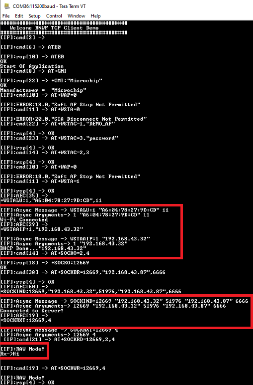

#  TCP Client Application
This application demonstrates a traditional open TCP client in the Host Companion mode. In this application the RNWF02 will host a TCP Client in Wi-Fi STA mode. The user is required to configure the Wi-Fi credentials for Home-AP and provide the necessary details for the remote TCP server configuration. By default the application will connect to Home-AP and begin a TCP client socket connection with a TCP server. After establishing a successful TCP server-client connection, the data exchange will take place.

## Building the Application

To build this application, open the project file \(`apps/tcp_client/sam_e54_xpro_rnwf_uart.X/`\) in MPLAB X IDE. For more details on opening the project file in MPLAB X IDE, refer to the [Opening the Project file](../wifi_easy_config/docs/GUID-671CCA8C-64AE-4EA1-B144-D46A6FEE76FF.md). The following table provides details on the project file.

|Project Name|Description|
|:-----------|:----------|
|`sam_e54_xpro_rnwf_uart.X`| -   MPLAB X project for SAM E54 Xplained Pro evaluation kit and RNWF02 Add On Board
-   This application demonstrates a traditional open TCP client in Host Companion mode. After establishing a successful TCP server-client connection, the data exchange will take place

## Running the Application

1.  Mount the RNWF02 Add On Board on SAM E54 Xplained Pro evaluation kit at respective header. For more details about the boards placement in the SAM E54 X-plained host board, see [Figure 6-1](../wifi_easy_config/docs/GUID-7BA99DE1-89EB-4DD7-973B-974B175D657A.md#FIG_B4M_3WX_PZB)
2.  Connect the debugger USB port on the SAM E54 Xplained Pro evaluation kit to computer using a micro-USB cable.
3.  Open the project and launch MCC Harmony3.
4.  Configure Home-AP credentials for STA mode, using the RNWF02 Wi-Fi configuration options. For more details about the Wi-Fi settings configuration, See [Figure 3-52](../wifi_easy_config/docs/GUID-CE9CEDFD-5FD4-4BC4-AB96-17647C430816.md#GUID-98F61951-56D2-4B91-B509-2A796802408B).
5.  Configure TCP Server details such as TCP server IP address and port. For more details about the Net Sock settings configuration, See [Figure 1](docs/GUID-834E84DC-609A-4A37-853F-3552166E1009.md#FIG_M55_PXS_SZB).
6.  Generate the code as illustrated below.

    Figure 6-11. Generating the Code

    

7.  Build and program the code to the hardware using MPLABX IDE

    Figure 6-12. Programming the Board

    

8.  Open the Terminal application \(for example, Tera Term or PuTTY\) on the PC

9.  Connect to the “EDBG Virtual COM Port" and configure the serial settings as follows:

    1.  Baud: 115200

    2.  Data: 8 Bits

    3.  Parity: None

    4.  Stop: 1 Bit

    5.  Flow Control: None

10. As the board boots up, it will connect to Home-AP and print the IP address obtained. The board will establish a connection with configured TCP Server and print a success message. Once the TCP client-server connection is successful, the application will continue listening on the socket for incoming messages and then write them back to the server.

     

    

     

    Figure 6-14. Mobile App TCP Server Logs

    

## Porting to the new Platform
The SAMC21 folder serves as a reference project for porting the WINC driver to a new MCU platform. The `SAMC21/src/winc/` directory should be integrated into the new platform project files.

1. Debug Macros in `winc_definitions.h`
    The winc_definitions.h file includes debug macros such as `SYS_CONSOLE_PRINT` and `SYS_DEBUG_PRINT`. The application can implement these macros to enable debugging features via the console.

2. Configuration Parameters in `winc_configuration.h`
    The `winc_configuration.h` file contains parameters for configuring the WINC driver. These settings can be adjusted by the application to suit the new platform.

3. Adapting SPI and GPIO Drivers
   The following files need to be implemented by the application to adapt to the new platform's SPI and GPIO drivers:
   - `driver\wifi\wincs02\dev\wdrv_winc_eint.c`
   - `driver\wifi\wincs02\dev\wdrv_winc_spi.c`

4. Driver Implementation Guidance
    The `winc_configuration.h` file defines helper warning macros to indicate which drivers need to be implemented. However, not all drivers are required. The application can optimize the integration by leveraging platform-specific interface functions.

    **Best Practices**
    - Retain the original function names.
    - Use the original functions as wrapper interfaces.

    These practices simplify maintenance and ensure compatibility with future updates that align with the original interface design.

